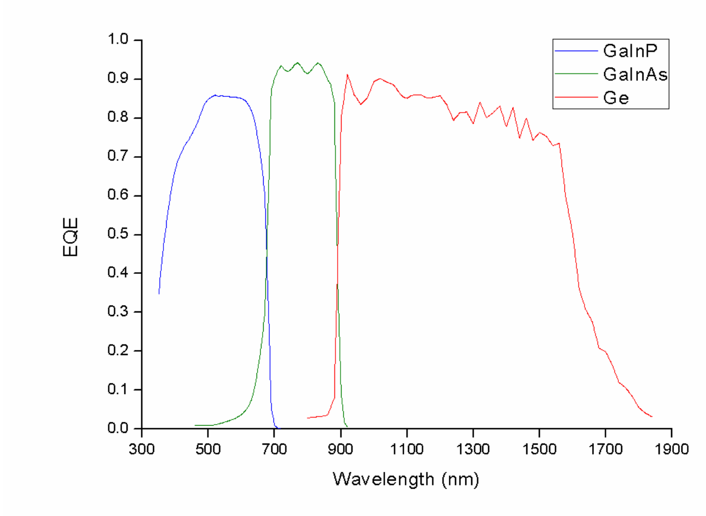
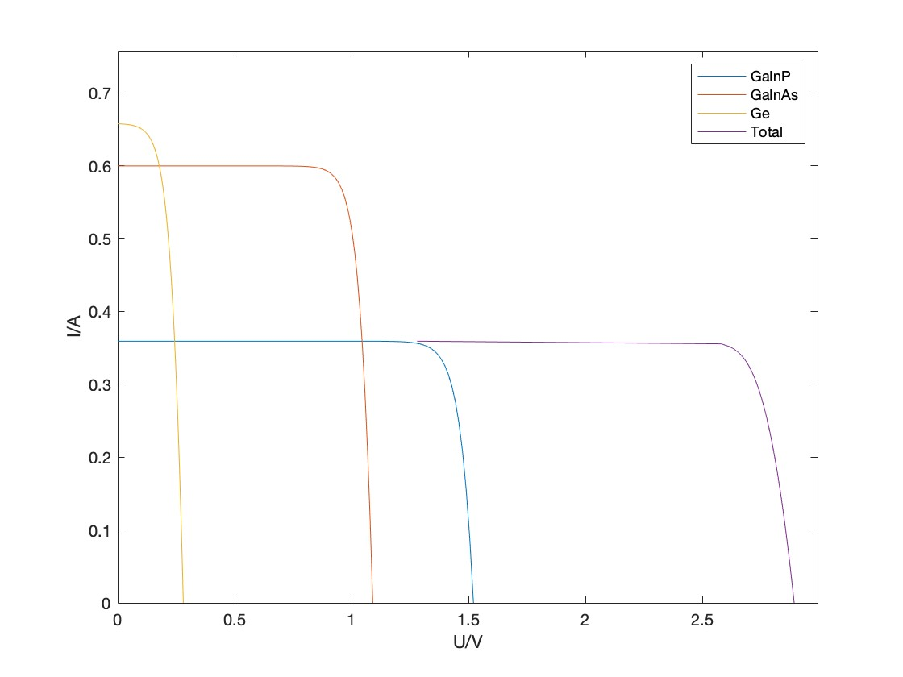

---

url_pdf: ''
summary: This project is my master's project. The project aims to investigate the output characteristics of multi-junction photovoltaic cells under polychromatic laser irradiation.
url_video: ""
external_link: ""
url_slides: ""
title: Research on Polychromatic Laser Power Transmission Using Multi-junction Solar Cell
date: '2022-01-01T13:00:00Z'
date_end: ''
links: []
image:
  focal_point: Smart
  caption: "Diagram"
url_code: ""
---
For satellite energy supply, it will not be able to harvest energy from the sun when located on the shadow side. To address this problem, this study uses multiple color lasers to irradiate the most common triple-junction solar cells on satellites and derives their best laser ratios through PV cell theory. For the non-uniformity of the laser beam, we investigated the power generation characteristics and thermal properties of the multi-junction cell. This study will provide some theoretical guidance for space energy supply.

For triple-junction solar PV cells, the most important thing is the current matching between sub-cells, which can be modeled and calculated using EQE.In this study, we investigate the output characteristics of multi-junction cells using adjustable power lasers of 520 nm and 808 nm and 940 nm.

Regarding the effect of inhomogeneous irradiation of laser light on the cell, please refer to the PDF file of the Chinese paper written so far, and the modeling analysis of single-junction cell with monochromatic light has been completed.
