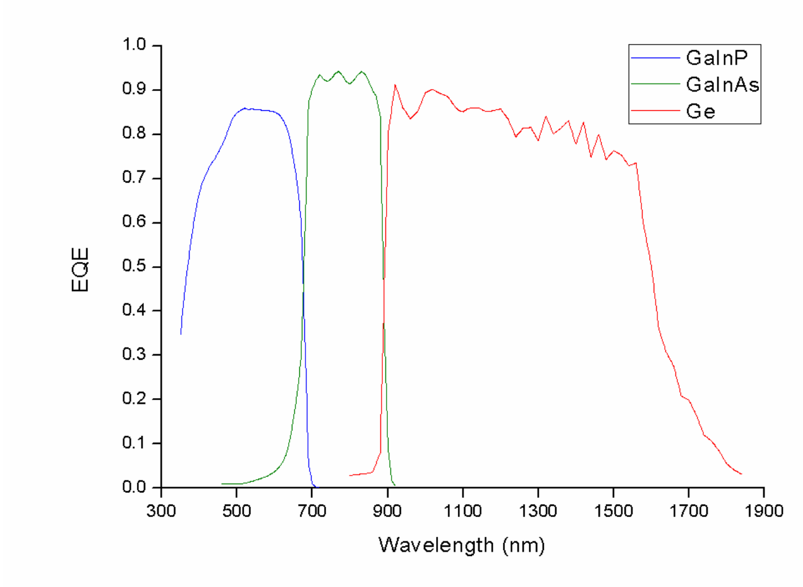
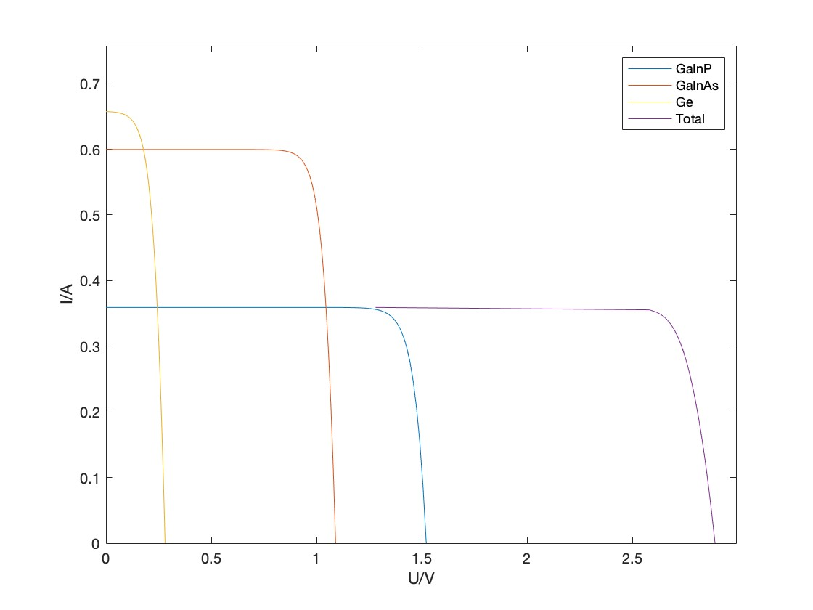

---

url_pdf: ''
summary: 这个项目是我的硕士课题，该项目旨在研究多色激光照射下多结光伏电池的输出特性。
url_video: ""
external_link: ""
url_slides: ""
title: 基于三结太阳能电池的多色激光无线传能的研究
date: '2022-01-01T13:00:00Z'
date_end: ''
links: []
image:
  focal_point: Smart
  caption: "示意图"
url_code: ""
---
对于卫星的供能来说，当卫星位于行星的阴影面时，它将无法从太阳中获取能量。为了解决这个问题，本研究使用多种彩色激光器来照射卫星上最常见的三结太阳能电池，并通过光伏电池理论得出其最佳激光比率。对于激光器光束的不均匀性，我研究了多结电池的发电特性和热特性。这项研究将为空间能源供应提供一些理论指导。

对于三结太阳能光伏电池，最重要的是子电池之间的电流匹配，这可以用外量子效率（EQE）来建模和计算。在这项研究中，我利用了520nm、808nm和940nm的可调功率激光器研究了多结电池在多色激光辐照下的输出特性。

关于激光光束的不均匀照射对电池的影响，请参照PDF文件上的论文，单色光的单结电池的建模分析已经完成。
